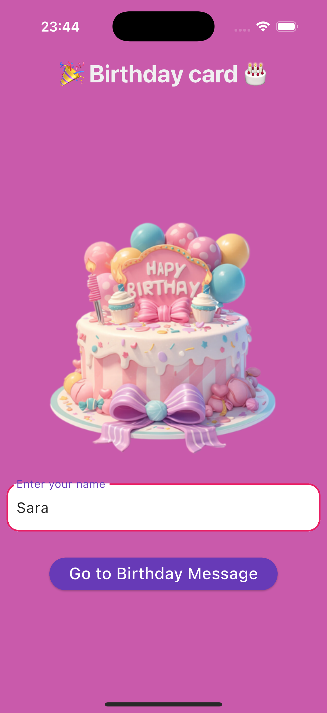
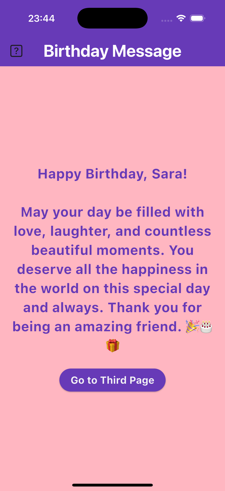
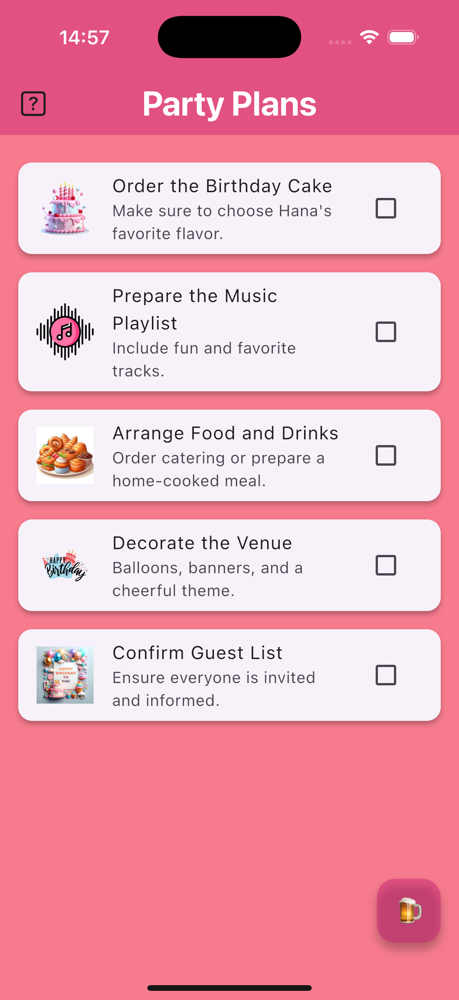
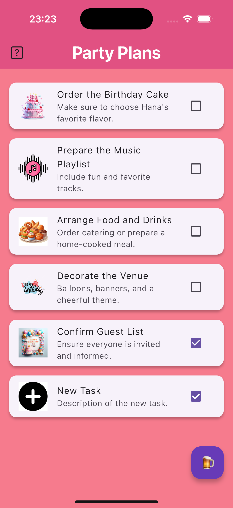
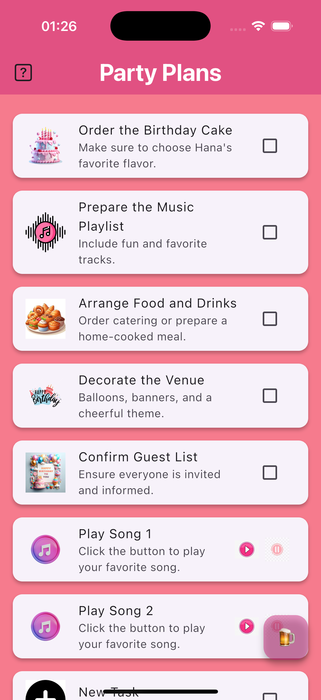
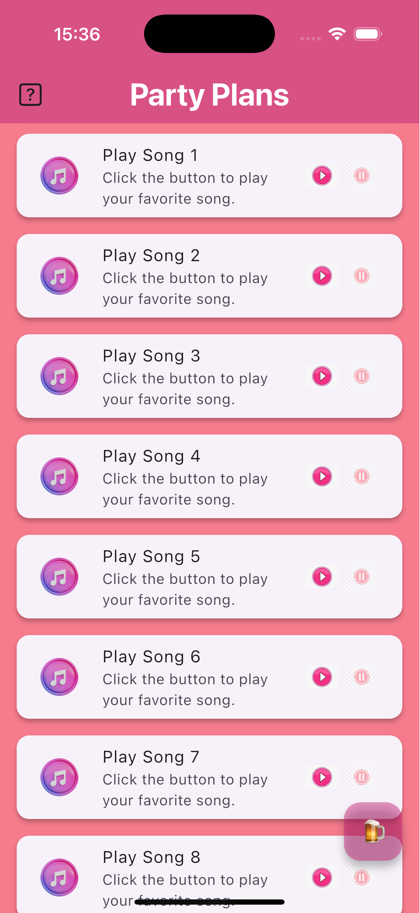

# Birthday 🎉

A new Flutter project for celebrating birthdays.

## Getting Started 🚀

This project is a starting point for a Flutter application.

### Preview 📸

#### First Page:


#### Second Page:


#### Third Page:






## How to Use Images in Flutter 🖼️

1. Define your images in the `pubspec.yaml` file:
   ```yaml
   flutter:
     assets:
       - assets/firstpage.png
       - assets/secondpage.png
       - assets/thirdpage.png
       - assets/thirdpage2.png
       - assets/thirdpage3.png
       - assets/thirdpage4.png

       

# birthday
